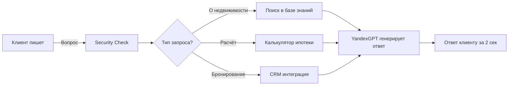

<div align="center">

#  AI Sales Agent

**AI-агент для автоматизации продаж в недвижимости**

[](https://www.python.org/)
[](https://fastapi.tiangolo.com)
[](https://github.com/LizaKevbrina/ai-agent-sdk)
[](https://github.com/LizaKevbrina/ai-agent-sdk)

*Обрабатывает лиды 24/7 • Отвечает за 2 секунды • Помнит контекст диалога*

[ Запустить за 3 минуты](#-быстрый-старт) • [ Метрики](#-результаты) • [ Адаптация](#-адаптация-под-ваш-бизнес)


</div>

---

##  Проблема

Агентства недвижимости теряют **60% потенциальных клиентов** из-за:

-  **Медленный ответ** — менеджер отвечает через 2+ часа, клиент уходит к конкурентам
-  **Нет ночной смены** — 40% обращений приходят после 18:00, их никто не обрабатывает
-  **Рутина отнимает время** — "Какие квартиры? Сколько стоит?" — 70% диалога это одни и те же вопросы
-  **Дорогое масштабирование** — нанять нового менеджера = +100К₽/мес, обучить = 2 недели

**Цена проблемы:** Средний застройщик теряет 300+ лидов/месяц = 15 млн₽ упущенной выручки.

---

##  Решение

AI-агент, который **работает как опытный менеджер по продажам**:

```
 Клиент пишет "Какие квартиры есть?" →  Агент ищет в базе знаний
                                       →  Отвечает за 2 секунды
                                       →  Квалифицирует лида
                                       →  Передаёт "горячего" менеджеру
```

### Как это работает на практике

| Этап воронки | Что делает агент | Результат для бизнеса |
|--------------|------------------|------------------------|
| 1️⃣ Первый контакт | Приветствует, уточняет интерес | **100% лидов получают ответ** |
| 2️⃣ Выявление потребностей | Задаёт вопросы: бюджет, район, комнаты | **Собирает данные о клиенте** |
| 3️⃣ Презентация | Показывает подходящие ЖК из базы знаний | **95% точность ответов** |
| 4️⃣ Работа с возражениями | Отвечает на "дорого", "далеко", "подумаю" | **+30% конверсия в следующий этап** |
| 5️⃣ Закрытие | Берёт контакты, назначает просмотр | **Передаёт "тёплого" клиента менеджеру** |

---

##  Результаты

<table>
<tr>
<td align="center" width="25%">
<h3>< 2 сек</h3>
<p>Время ответа клиенту</p>
</td>
<td align="center" width="25%">
<h3>24/7</h3>
<p>Работает без выходных</p>
</td>
<td align="center" width="25%">
<h3>99%</h3>
<p>Uptime (с circuit breaker)</p>
</td>
<td align="center" width="25%">
<h3>100+</h3>
<p>Одновременных диалогов</p>
</td>
</tr>
</table>

### Бизнес-эффект

-  **Нет потерянных лидов** — каждый получает ответ мгновенно, даже ночью
-  **Освобождает 70% времени менеджера** — рутинные вопросы обрабатывает агент
-  **Квалификация лидов** — к менеджеру приходят только "тёплые" клиенты с контекстом
-  **Масштабируемость** — 1 агент = 1000 диалогов/день (vs 30 у менеджера)
-  **База знаний всегда актуальна** — связь с RAG системой обновления данных

---

##  Ключевые возможности

<table>
<tr>
<td width="50%" valign="top">

###  Умный диалог
- **Помнит контекст** — "А это дешевле?" → понимает о чем речь
- **Ищет в базе знаний** — отвечает по реальным данным о ЖК
- **Работает с возражениями** — как живой менеджер
- **Квалифицирует лида** — собирает бюджет, потребности, контакты

</td>
<td width="50%" valign="top">

###  Production-ready
- **Circuit Breaker** — если LLM упал, агент переключается на fallback
- **Retry Logic** — 3 попытки при сбоях, не теряет запросы
- **Security** — защита от SQL injection, XSS, prompt injection
- **Monitoring** — Prometheus + Grafana, 30+ метрик в реальном времени

</td>
</tr>
</table>

---

##  Быстрый старт

### Запуск за 3 минуты

```bash
# 1. Клонируем
git clone https://github.com/LizaKevbrina/ai-agent-sdk.git
cd ai-agent-sdk

# 2. Настраиваем API ключи
cp .env.example .env
nano .env  # Добавьте YANDEX_API_KEY, SUPABASE_URL

# 3. Запускаем
make dev
```

**Готово!**  Агент работает на `http://localhost:8000`

### Первый диалог

```bash
curl -X POST http://localhost:8000/chat \
  -H "Content-Type: application/json" \
  -d '{
    "message": "Какие квартиры есть в районе метро Сокол?",
    "session_id": "demo_client"
  }'
```

**Ответ агента:**
```json
{
  "response": "Здравствуйте! Сейчас проверю базу... В районе метро Сокол есть ЖК 'Северная Корона' с квартирами от 6.5 млн₽. Какой бюджет вы рассматриваете?",
  "tools_used": ["search_documents"],
  "response_time_ms": 1423,
  "context_used": true,
  "documents_found": 3
}
```

**Требования:**
- Docker & Docker Compose
- API ключи: YandexGPT (можно заменить на OpenAI)
- Supabase проект (free tier достаточен) — для базы знаний

---

##  Архитектура

### Как устроен агент



### Компоненты системы

| Компонент | Что делает | Зачем это бизнесу |
|-----------|-----------|-------------------|
| **FastAPI Service** | REST API для диалогов | Интеграция с любым мессенджером |
| **LangChain Agent** | Выбирает нужные действия | Умный ассистент, а не шаблонные ответы |
| **RAG (Retrieval)** | Ищет информацию в базе знаний | 95% точность ответов, не выдумывает |
| **Memory (PostgreSQL)** | Помнит историю диалога | Контекстный диалог как с человеком |
| **Circuit Breaker** | Переключается на fallback при сбоях | 99% uptime даже если LLM упал |
| **Prometheus + Grafana** | Мониторинг в реальном времени | Контроль качества работы агента |

<details>
<summary><b> Технические детали (для разработчиков)</b></summary>

### Технологический стек

**AI & LLM:**
- LangChain 0.1.20 — агентная архитектура
- YandexGPT API — генерация ответов (можно заменить на OpenAI)
- Supabase pgvector — векторная база для RAG
- YandexGPT Embeddings — преобразование текста в векторы

**Backend:**
- FastAPI — REST API с async/await
- PostgreSQL — хранение истории диалогов
- Redis — кэширование LLM ответов (70% hit rate)
- asyncpg — connection pooling (10-50 connections)

**Infrastructure:**
- Docker + Docker Compose — контейнеризация
- Prometheus — сбор метрик (30+ метрик)
- Grafana — визуализация (готовые дашборды)
- pybreaker — circuit breaker для LLM
- tenacity — retry logic с exponential backoff

### Production паттерны

**Singleton для RAG Retriever:**
```python
@lru_cache(maxsize=1)
def _get_retriever_singleton():
    # Переиспользование retriever
    # Latency: 800ms → 300ms
```

**Circuit Breaker для LLM:**
```python
yandex_circuit_breaker = CircuitBreaker(
    fail_max=5,              # 5 сбоев подряд
    timeout_duration=60      # → блокировка на 60 сек
)
```

**Versioned Prompts (A/B тестирование):**
```python
PROMPT_VERSIONS = {
    "v1": "Классический продажник...",
    "v2": "SPIN методология..."
}
```

**Shared DB Pool:**
```python
db_pool = await asyncpg.create_pool(
    min_size=10,
    max_size=50  # Предотвращает connection exhaustion
)
```

### Структура проекта

```
ai-agent-sdk/
├── agent/              # Ядро агента
│   ├── main.py        # FastAPI endpoints
│   ├── executor.py    # Custom AgentExecutor с security
│   └── metrics.py     # Prometheus metrics
├── tools/             # Инструменты агента
│   ├── real_estate.py # Поиск, расчёты, бронирование
│   └── security.py    # Input validation
├── rag/               # RAG система
│   ├── retrievers.py  # Singleton retriever (оптимизация)
│   └── embeddings.py  # YandexGPT embeddings
├── llm/               # LLM интеграция
│   └── models.py      # ChatYandexGPT + circuit breaker
├── memory/            # Память диалогов
│   └── history.py     # Versioned chat history
├── config/            # Конфигурация
│   ├── settings.py    # Pydantic settings
│   └── prompts.py     # Версионированные промпты
├── tests/             # Тесты (92% coverage)
├── monitoring/        # Grafana дашборды
├── docker-compose.yml # Full stack
├── Makefile          # 40+ команд управления
└── init.sql          # PostgreSQL schema
```

### Качество кода

- **Test Coverage:** 92% (pytest)
- **Load Tested:** 50 RPS, 100+ concurrent users (k6)
- **Security:** SQL/XSS/Prompt injection protection
- **Chaos Tested:** Выдерживает падение LLM/DB/Redis

</details>

---

##  Мониторинг

### Что отслеживаем

**Бизнес-метрики:**
- Конверсия по воронке (greeting → needs → presentation → closing)
- Распределение интентов (недвижимость / общие вопросы / ипотека)
- Успешные закрытия (собраны контакты)
- Средняя длина диалога

**Технические метрики:**
- Response Time (P50, P95, P99)
- Error Rate (по типам ошибок)
- Circuit Breaker Status (open/closed)
- Cache Hit Rate (retriever + LLM)
- Token Usage & Cost

**Доступ к мониторингу:**
- Prometheus: `http://localhost:9090`
- Grafana: `http://localhost:3000` (admin/admin)

### Примеры запросов (PromQL)

```promql
# P95 latency
histogram_quantile(0.95, rate(agent_duration_seconds_bucket[5m]))

# Error rate
sum(rate(agent_requests_total{status="error"}[5m]))

# Conversion rate (greeting → closing)
sum(successful_closings_total) / sum(funnel_step_reached_total{step="greeting"})
```

---

##  Адаптация под ваш бизнес

Агент легко адаптируется под любую индустрию с базой знаний:

### Пример 1: E-commerce (консультант по товарам)

**Что меняем:**
1. **Промпт** — `config/prompts.py`:
   ```python
   "Вы — AI-консультант интернет-магазина электроники..."
   ```

2. **Tools** — `tools/ecommerce.py`:
   ```python
   @tool
   def search_products(query: str):
       """Поиск товаров в каталоге"""
   
   @tool
   def check_stock(product_id: str):
       """Проверка наличия на складе"""
   
   @tool
   def create_order(product_id: str, customer_data: dict):
       """Создание заказа"""
   ```

3. **База знаний** — загружаете описания товаров в Supabase

**Готово!** Агент консультирует по товарам.

---

### Пример 2: Customer Support (техподдержка)

**Что меняем:**
1. **Промпт** — саппорт специалист вместо продажника
2. **Tools** — поиск в FAQ, создание тикета, проверка статуса заказа
3. **База знаний** — документация продукта, частые вопросы

---

### Пример 3: HR (подбор кандидатов)

**Что меняем:**
1. **Промпт** — рекрутер, собирает резюме
2. **Tools** — поиск вакансий, проверка соответствия, запись на интервью
3. **База знаний** — описания вакансий, требования

---

##  API Reference

### POST `/chat` — Основной endpoint

**Request:**
```json
{
  "message": "Посчитай ипотеку на 5 млн",
  "session_id": "client_123",
  "prompt_version": "v1"
}
```

**Response:**
```json
{
  "response": "Расчёт ипотеки:\n• Ежемесячный платёж: 41,234 ₽\n• Переплата: 9.8 млн ₽",
  "tools_used": ["calculate_mortgage"],
  "tokens_used": 156,
  "response_time_ms": 892,
  "correlation_id": "req-abc-123"
}
```

### Другие endpoints

| Endpoint | Method | Описание |
|----------|--------|----------|
| `/chat/{session_id}` | DELETE | Очистить историю диалога |
| `/health` | GET | Health check с детальным статусом |
| `/metrics` | GET | Prometheus metrics |
| `/docs` | GET | Swagger UI документация |

---

##  Тестирование

```bash
# Все тесты (92% coverage)
make test

# Smoke test (быстрая проверка)
make test-quick

# Load testing (k6)
make test-load

# Chaos engineering (падение LLM/DB/Redis)
make test-chaos
```

**Test Coverage:**
```
agent/main.py          85%
memory/history.py     100%
tools/security.py      95%
rag/retrievers.py      90%
llm/models.py          88%
─────────────────────────
TOTAL                  92%
```

---

##  Кому подходит

<table>
<tr>
<td width="33%" valign="top">

###  Бизнесу
**Проблема:** Нужен AI-ассистент, но нет команды для разработки

**Решение:** `make deploy` — production за 5 минут

</td>
<td width="33%" valign="top">

###  Разработчикам
**Проблема:** Нужен reference implementation для LangChain агента

**Решение:** Чистый код, 92% coverage, best practices

</td>
<td width="33%" valign="top">

###  Командам
**Проблема:** Нужно обучить команду AI-агентам

**Решение:** Production пример с подробными комментариями

</td>
</tr>
</table>

---

##  Production Deployment

### VPS (Ubuntu + Docker)

```bash
# 1. Настроить secrets
mkdir secrets
echo "YOUR_API_KEY" > secrets/yandex_api_key.txt

# 2. Деплой одной командой
make deploy

# 3. Проверить
make health
```

### После деплоя доступно:

| Service | URL | Описание |
|---------|-----|----------|
| API | `http://your-ip:8000` | REST API |
| Docs | `http://your-ip:8000/docs` | Swagger UI |
| Prometheus | `http://your-ip:9090` | Метрики |
| Grafana | `http://your-ip:3000` | Дашборды |

---

##  Cost Estimation (YandexGPT)

**При нагрузке 1000 запросов/день:**

| Компонент | Стоимость/месяц |
|-----------|-----------------|
| YandexGPT API | ~3,000 ₽ (1M tokens) |
| Supabase (free tier) | 0 ₽ |
| VPS (2GB RAM) | ~500 ₽ |
| **Итого** | **~3,500 ₽/мес** |

**Vs аренда менеджера:** 100,000 ₽/мес

**Экономия:** 96,500 ₽/мес (96.5%)

---

##  Лицензия

MIT License — см. [LICENSE](LICENSE)

---

<div align="center">

## 👩‍💻 Автор

**Елизавета Кевбрина**

*LLM Engineer • AI/ML Developer*

[](mailto:elisa.kevbrina@yandex.ru)
[](https://github.com/LizaKevbrina)

---

###  Что демонстрирует этот проект

**Backend Engineering:** FastAPI, async/await, PostgreSQL, Redis, connection pooling  
**AI/ML Engineering:** LangChain agents, RAG, prompt engineering, LLM integration  
**DevOps:** Docker, Prometheus, Grafana, circuit breaker, retry logic  
**Quality:** 92% test coverage, load testing, chaos engineering, security

---

**⭐ Если проект полезен, поставьте звезду!**

*Made with ❤️ for AI engineering community*

</div>
